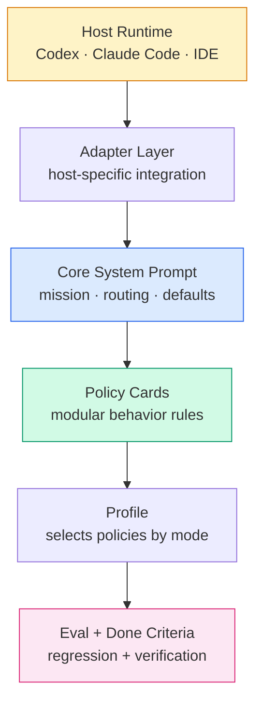

<div align="center">

# Feibo Deck

### Reverse-engineered from a production-grade system prompt into a portable, tested AI agent governance kit.


</div>

---

> **TL;DR** — We took a ~1,600-line production system prompt (Claude Fable 5) apart across three iterations, kept the durable engineering *mechanisms* (routing, verification, memory honesty, source freshness, output contracts), threw away the non-portable *claims* (identity, brand, hardcoded dates, tool schemas), and reassembled them as modular policy cards with executable regression tests — installable into Codex, Claude Code, or any IDE assistant with one command.

## The Origin

This kit was **not** written from scratch. It was **extracted**.

The source corpus is `claude-fable-5-system-prompt.md`, a mature assistant prompt that encodes not just a persona but a layered control system: priorities, routing rules, tool usage, memory assumptions, output style, safety boundaries, and verification habits.

### What was kept vs. what was discarded

| Kept (mechanisms) | Discarded (claims) |
|---|---|
| Inspect-before-assume routing | Claude / Anthropic identity |
| Verify-before-claim completion loop | Product names & URLs |
| Current-source for volatile facts | Hardcoded knowledge-cutoff dates |
| Memory honesty (no fabricated recall) | Platform-specific tool schemas |
| Prose-first output contracts | `{antml:invoke}` / artifact XML syntax |
| Routing by rate-of-change | `/mnt/user-data/outputs` paths |
| Failure-driven rule design | Refusal-handling tuned for consumers |

## The Three Extraction Rounds

This kit took shape over three rounds, each going deeper into the source prompt's design philosophy.

```
 Round 1 — SURFACE              Round 2 — STRUCTURE             Round 3 — EPISTEMOLOGY
 ─────────────────────          ─────────────────────           ─────────────────────────
 What rules say                 How rules behave                Why rules exist
 ─────────────────────          ─────────────────────           ─────────────────────────
 • Epistemic precision          • Anti-patterns (9 modes)       • Research planning
 • Read-before-write            • Single-question limit         • Calibrated skepticism
 • Prose-first formatting       • Tool-theater avoidance        • Conflict → search more
                                • Inventory-before-invent       • Partial-recognition trap
                                • Governance meta-principle     • Pre-output self-check
  evals: 23                     evals: 28                       evals: 33  ✓
```

Every rule in the kit traces back to a **specific line in Fable 5** that itself traces back to an **observed production failure**. That lineage is documented in [`notes/source-prompt-map.md`](agents/agent-harness/notes/source-prompt-map.md).

## What Problem It Solves

AI agents fail in predictable ways. They answer from stale memory, summarize files they never opened, claim tests passed when nothing ran, produce chat text when a file was requested, or behave inconsistently across tools because every host has a separate prompt.

Feibo Deck makes agent behavior **modular, verifiable, and portable**.

## How It Works



## What It Provides

| Layer | Artifacts | Purpose |
|---|---|---|
| **Core** | `SYSTEM.md` | Mission, priority order, operating defaults |
| **Policies** | 12 policy cards | Modular rules: research, files, tools, memory, safety, style, routing, preflight, context-refresh, verification, coding-discipline, anti-patterns |
| **Profiles** | 3 profiles | `core` · `coding` · `research` — pick the right policy mix |
| **Adapters** | 4 adapters | `core` · `codex` · `claude-code` · `ide` (Cursor/Copilot/Windsurf) |
| **Evals** | 33 cases | Executable regression with `enforced_by` anchors |
| **Checks** | Done criteria | 16 deterministic gates, no model judgment required |

## Quick Start

```bash
# See what's available
python scripts/agent_harness.py list

# Compile the coding profile for your host
python scripts/agent_harness.py compile --profile coding --target codex
python scripts/agent_harness.py compile --profile coding --target claude-code
python scripts/agent_harness.py compile --profile coding --target ide

# Install into a real project (writes AGENTS.md / CLAUDE.md / rules)
python scripts/agent_harness.py install --profile coding --target claude-code --project .

# Prove the kit is healthy
python scripts/agent_harness.py eval      # 33 regression cases
python scripts/agent_harness.py verify    # 16 done-criteria gates
python scripts/agent_harness.py doctor --profile coding --target codex
```

> Python 3.10+, standard library only. **Zero dependencies. No install step.**

## Why This Works When Ad-Hoc Prompts Don't

Most teams hand-tune a system prompt per tool. That prompt grows, rots, and is never tested. A rule gets deleted by accident and nobody notices.

Feibo Deck closes three gaps:

1. **Mechanisms over personality.** The portable part of a great prompt is *how it routes and verifies*, not *who it claims to be*.
2. **Rules are failure-driven.** No rule exists without a concrete failure it prevents — that's enforced as a governance principle, not just hoped for.
3. **Rules are test-protected.** Every protected rule has `enforced_by` anchors. Delete the rule, the eval turns red. The kit audits itself in CI.

## Design Principles

```
 ┌──────────────────────────────────────────────────────────────────┐
 │  Evidence over confidence   —  never claim what wasn't observed  │
 │  Read before write          —  unconditionally inspect first      │
 │  Current sources for change —  search when facts may differ       │
 │  Verify before completion   —  collect proof, then report         │
 │  Epistemic precision        —  separate observed / inferred /     │
 │                                assumed                            │
 │  Prose first                —  structure only when it earns it    │
 │  Failure-driven governance  —  every rule points to a real break  │
 └──────────────────────────────────────────────────────────────────┘
```

## Repository Layout

```
agents/agent-harness/
├── SYSTEM.md              Core kernel prompt
├── harness.json           Manifest linking all components
├── capabilities.json      Host capability matrix
├── done_criteria.json     Deterministic completion checks
├── policies/              ← 12 modular behavior cards
├── profiles/              ← core · coding · research
├── adapters/              ← core · codex · claude-code · ide
├── evals/                 ← 33 regression cases
└── notes/                 ← source-prompt-map tracing every extraction
scripts/
└── agent_harness.py       Zero-dependency CLI
```

## Common Workflows

| Goal | Action |
|---|---|
| Add a behavior rule | Write a policy card → include in profile → add an eval case |
| Add a routing detail | Extend `routing-examples.md` or `preflight-checks.md`, not the kernel |
| Support a new host | Add an adapter → register in `harness.json` → add capability entry |
| Tighten release gates | Add a check to `done_criteria.json` → run `verify` |
| Learn another source prompt | Follow the extraction method in `notes/source-prompt-map.md` |

## Safety Notes

Feibo Deck is a **prompt compiler, not a sandbox**. The host still controls tools, permissions, network, and memory. Host instructions always take priority over compiled harness text. The original Claude Fable 5 source prompt is kept as a design corpus only — it is never copied into compiled runtime prompts.

## Documentation

- [Chinese README](README.zh-CN.md) — 中文文档
- [CHANGELOG](CHANGELOG.md) — version history & extraction rounds
- [Design Notes](agent-harness-design.md) — architecture rationale
- [Source Prompt Map](agents/agent-harness/notes/source-prompt-map.md) — every rule's lineage

## License

MIT
