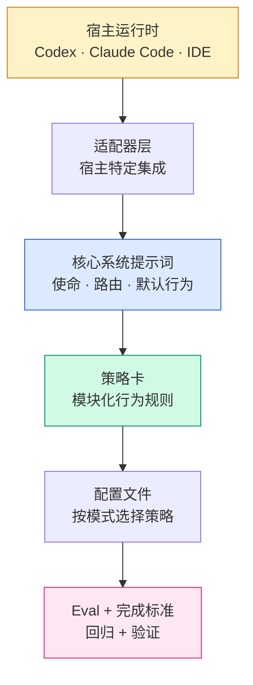

<div align="center">

# Feibo Deck

### 从一个生产级系统提示词逆向提炼，打造可移植、可测试的 AI Agent 治理套件。


</div>

---

> **一句话** — 我们把一个约 1600 行的生产级系统提示词（Claude Fable 5）经过三轮迭代拆解，保留其持久性的工程**机制**（路由、验证、记忆诚实、来源时效、输出契约），丢弃不可移植的**主张**（身份、品牌、硬编码日期、工具 schema），重新组装为带可执行回归测试的模块化策略卡——一条命令即可安装到 Codex、Claude Code 或任意 IDE 助手。

## 项目起源

这个套件**不是从零写的**，而是**逆向提取**出来的。

原始语料是 `claude-fable-5-system-prompt.md`，一个成熟助手的提示词。它编码的不只是一个角色，而是一个分层控制系统：优先级、路由规则、工具使用、记忆假设、输出风格、安全边界、验证习惯。

### 保留 vs. 丢弃

| 保留（机制） | 丢弃（主张） |
|---|---|
| 先检查再假设的路由 | Claude / Anthropic 身份 |
| 验证后才声称完成的循环 | 产品名与 URL |
| 易变事实用当前来源 | 硬编码的知识截止日期 |
| 记忆诚实（不伪造回忆） | 平台特定工具 schema |
| 散文优先的输出契约 | `{antml:invoke}` / artifact XML 语法 |
| 按变化速率路由 | `/mnt/user-data/outputs` 路径 |
| 失败驱动的规则设计 | 面向消费者的拒绝处理 |

## 三轮提取历程

这个套件分三轮逐步成型，每一轮都更深地触及源提示词的设计哲学。

```
 第一轮 — 表层              第二轮 — 结构层               第三轮 — 认知层
 ──────────────────         ──────────────────           ─────────────────────
 规则写了什么               规则如何行为                 规则为何存在
 ──────────────────         ──────────────────           ─────────────────────
 • 认知精确性               • 反模式（9 种）             • 研究规划
 • 写前必读                 • 单问题限制                 • 校准怀疑论
 • 散文优先格式             • 工具表演规避               • 冲突 → 追加搜索
                            • 先盘点再发明               • 部分识别陷阱
                            • 治理元原则                 • 输出前自检门
  evals: 23                 evals: 28                    evals: 33  ✓
```

套件中的每条规则都能追溯到 **Fable 5 中的某一行**，而那一行又追溯到**一次观察到的生产事故**。这条传承链记录在 [`notes/source-prompt-map.md`](agents/agent-harness/notes/source-prompt-map.md) 中。

## 解决什么问题

AI Agent 的失败模式是可预测的：凭过时记忆作答、从未打开文件就总结内容、声称测试通过但没运行、要求文件却输出聊天文本、在不同工具中行为不一致。

Feibo Deck 让 agent 行为变得**模块化、可验证、可移植**。

## 工作原理



## 提供什么

| 层 | 产物 | 用途 |
|---|---|---|
| **核心** | `SYSTEM.md` | 使命、优先级、默认行为 |
| **策略** | 12 张策略卡 | research、files、tools、memory、safety、style、routing、preflight、context-refresh、verification、coding-discipline、anti-patterns |
| **配置** | 3 个配置 | `core` · `coding` · `research`，挑选合适的策略组合 |
| **适配器** | 4 个适配器 | `core` · `codex` · `claude-code` · `ide`（Cursor/Copilot/Windsurf） |
| **Eval** | 33 个用例 | 带 `enforced_by` 锚点的可执行回归 |
| **检查** | 完成标准 | 16 道确定性闸门，无需模型判断 |

## 快速开始

```bash
# 查看可用项
python scripts/agent_harness.py list

# 为你的宿主编译编程配置
python scripts/agent_harness.py compile --profile coding --target codex
python scripts/agent_harness.py compile --profile coding --target claude-code
python scripts/agent_harness.py compile --profile coding --target ide

# 安装到真实项目（写入 AGENTS.md / CLAUDE.md / 规则文件）
python scripts/agent_harness.py install --profile coding --target claude-code --project .

# 证明套件健康
python scripts/agent_harness.py eval      # 33 个回归用例
python scripts/agent_harness.py verify    # 16 道完成标准闸门
python scripts/agent_harness.py doctor --profile coding --target codex
```

> Python 3.10+，仅用标准库。**零依赖。无需安装。**

## 为什么这比随手写提示词更有效

多数团队为每个工具手调一份系统提示词。那份提示词会膨胀、腐烂、且从不被测试。一条规则被误删，没人发现。

Feibo Deck 闭合了三个缺口：

1. **机制重于人格。** 一份好提示词的可移植部分是*它如何路由和验证*，不是*它自称是谁*。
2. **规则由失败驱动。** 没有规则是没有具体失败可防的——这是作为治理原则强制执行的，不是空想。
3. **规则受测试保护。** 每条受保护规则都有 `enforced_by` 锚点。删掉规则，eval 变红。套件在 CI 里自我审计。

## 设计原则

```
 ┌───────────────────────────────────────────────────────────────────┐
 │  证据优先于信心     —  绝不声称未观察到的内容                       │
 │  写前必读           —  无条件先检查                                  │
 │  变化的事实用当前源  —  事实可能不同时就搜索                          │
 │  完成前先验证        —  收集证明，再报告                              │
 │  认知精确性         —  分离 观察 / 推断 / 假设                       │
 │  散文优先           —  结构只在它挣得时使用                          │
 │  失败驱动治理        —  每条规则都指向一次真实故障                    │
 └───────────────────────────────────────────────────────────────────┘
```

## 仓库结构

```
agents/agent-harness/
├── SYSTEM.md              核心内核提示词
├── harness.json           清单文件，链接所有组件
├── capabilities.json      宿主能力矩阵
├── done_criteria.json     确定性完成检查
├── policies/              ← 12 张模块化行为卡
├── profiles/              ← core · coding · research
├── adapters/              ← core · codex · claude-code · ide
├── evals/                 ← 33 个回归用例
└── notes/                 ← source-prompt-map 记录每次提取的传承
scripts/
└── agent_harness.py       零依赖 CLI
```

## 常见工作流

| 目标 | 操作 |
|---|---|
| 添加行为规则 | 写策略卡 → 纳入配置 → 添加 eval 用例 |
| 添加路由细节 | 扩展 `routing-examples.md` 或 `preflight-checks.md`，而非内核 |
| 支持新宿主 | 添加适配器 → 在 `harness.json` 注册 → 添加能力条目 |
| 收紧发布闸门 | 在 `done_criteria.json` 添加检查 → 运行 `verify` |
| 学习另一个源提示词 | 按 `notes/source-prompt-map.md` 中的提取方法 |

## 安全说明

Feibo Deck 是**提示词编译器，不是沙箱**。宿主仍然控制工具、权限、网络和记忆。宿主指令始终优先于编译后的 harness 文本。原始 Claude Fable 5 源提示词仅作为设计语料保留——绝不复制进编译后的运行时提示词。

## 文档

- [English README](README.md) — English documentation
- [CHANGELOG](CHANGELOG.md) — 版本历史与提取轮次
- [设计笔记](agent-harness-design.md) — 架构依据
- [源提示词映射](agents/agent-harness/notes/source-prompt-map.md) — 每条规则的传承

## 许可证

MIT
